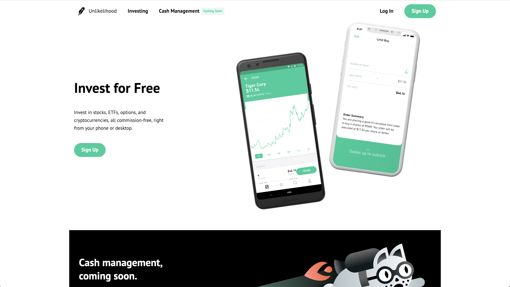

# Unlikelihood

Unlikelihood is a Robinhood clone where users can view stock market price data, add stocks to their watchlist, and test their investing skills through buying and selling stocks using the starting balance chosen when they created their account.

You can access the site at https://unlikelihood.herokuapp.com

## Tech Used

### Backend

1. Ruby
2. Rails
3. PostgreSQL
4. jBuilder
5. Heroku

### Frontend

1. Javascript
2. React
3. Redux
4. Webpack

### Stock Market API

1. [IEX](https://iextrading.com)

